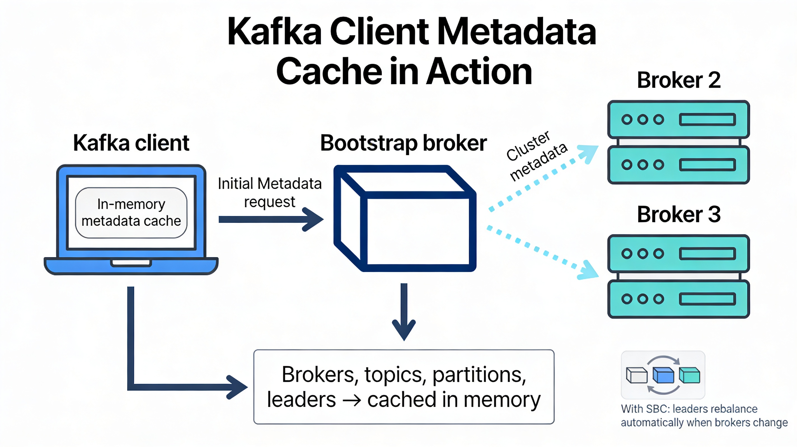
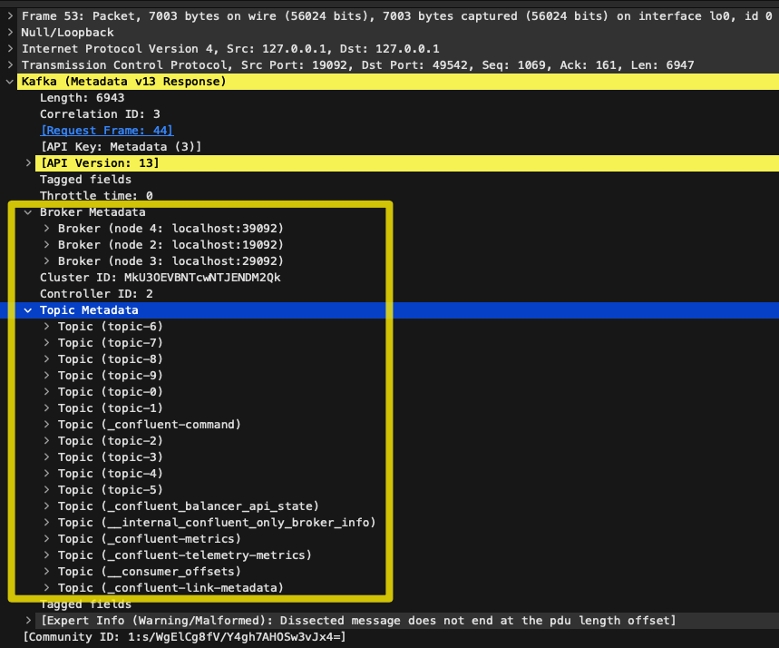
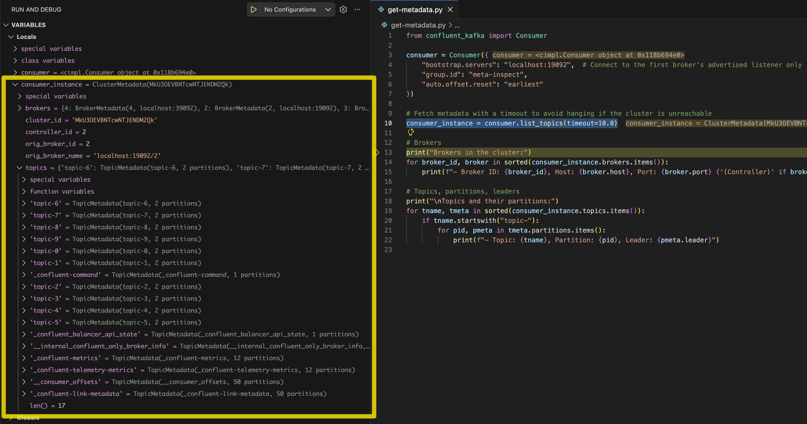

# Kafka Metadata Fetching and Caching Demo

This repo shows how a Kafka client **discovers the full cluster** and **caches metadata** even when it only bootstraps to a single broker.


It uses:

- [Confluent Platform](https://docs.confluent.io/platform/current/get-started/platform.html) running on Docker (KRaft mode: 1x controller + 3x brokers)
- A simple Python script using the Confluent Kafka Python client

The goal is to help developers **see and reason about Kafka metadata**: brokers, topics, partitions, and leaders, and understand how the client caches and refreshes this data.

## Pre‑Requisites

- [Docker](https://docs.docker.com/get-started/get-docker/)
- [Docker Compose](https://docs.docker.com/compose/install/)
- [Python 3.11 or above](https://www.python.org/downloads/)

## Setup (one time only)

Create and activate a Python virtual environment, then install the Confluent Kafka Python library:

```bash
python3 -m venv .venv
source .venv/bin/activate
pip install confluent-kafka
deactivate
```

## Cluster Overview

The Docker Compose file starts:

- **1x KRaft controller node** (`controller-1`)
- **3x Kafka brokers** (`kafka-1`, `kafka-2`, `kafka-3`)
- **1x setup container** that creates 10 demo topics (`topic-0`, ..., `topic-9`), each with:
  - **Partitions = 2**
  - **Replication factor = 3**
  - `min.insync.replicas=2`

All brokers share the same `CLUSTER_ID` (`MkU3OEVBNTcwNTJENDM2Qk`), and expose a **PLAINTEXT listener** to the host on:

- `localhost:19092` → `kafka-1`
- `localhost:29092` → `kafka-2`
- `localhost:39092` → `kafka-3`

## Start the Cluster

From the directory containing the `docker-compose.yml` file:

```bash
source .venv/bin/activate
docker compose up -d
```

You should see output similar to:

```text
 ✔ Network kafka-metadata_default               Created
 ✔ Container kafka-metadata-controller-1-1      Started
 ✔ Container kafka-metadata-kafka-2-1           Healthy
 ✔ Container kafka-metadata-kafka-3-1           Healthy
 ✔ Container kafka-metadata-kafka-1-1           Healthy
 ✔ Container kafka-metadata-kafka-setup-1       Started
```

Wait until all brokers are **Healthy** before continuing.

## List and Inspect Topics

Once the cluster is healthy, list all topics (using one of the brokers as a bootstrap):

```bash
docker compose exec controller-1 kafka-topics \
  --bootstrap-server kafka-1:19092 \
  --list
```

You should see something like:

```text
__consumer_offsets
__internal_confluent_only_broker_info
_confluent-command
_confluent-link-metadata
_confluent-telemetry-metrics
_confluent_balancer_api_state
topic-0
topic-1
topic-2
topic-3
topic-4
topic-5
topic-6
topic-7
topic-8
topic-9
```

If you don’t see all 10 `topic-n` topics, wait a minute and try again (the `kafka-setup` container might still be creating them).

Inspect a topic’s details:

```bash
docker compose exec controller-1 kafka-topics \
  --bootstrap-server kafka-2:29092 \
  --describe --topic topic-0
```

Example output:

```text
Topic: topic-0 TopicId: PMUy4K7SQKKwleu1n5d3AA PartitionCount: 2 ReplicationFactor: 3 Configs: min.insync.replicas=2
  Topic: topic-0 Partition: 0 Leader: 2 Replicas: 2,3,4 Isr: 2,3,4 Elr: LastKnownElr:
  Topic: topic-0 Partition: 1 Leader: 3 Replicas: 3,4,2 Isr: 3,4,2 Elr: LastKnownElr:
```

This shows that:

- `topic-0` has **2 partitions**
- Each partition has **3 replicas** (on brokers with IDs 2, 3, 4)
- All replicas are **in-sync** (`Isr` contains all 3)
- The **Leader** is the broker currently serving reads/writes for each partition

## Python Script: How the Consumer Discovers All Brokers

Now that the cluster is up and topics are created, run a simple Python consumer (`get-metadata.py`) that:

- Bootstraps to **only one** broker (`localhost:19092`)
- Fetches **cluster metadata** once
- Prints the discovered brokers and topic-partition leaders

Run the experiment:

```bash
python3 get-metadata.py
```

Example output:

```text
Brokers in the cluster:
- Broker ID: 2, Host: localhost, Port: 19092
- Broker ID: 3, Host: localhost, Port: 29092
- Broker ID: 4, Host: localhost, Port: 39092

Topics and their partitions:
- Topic: topic-0, Partition: 0, Leader: 2
- Topic: topic-0, Partition: 1, Leader: 3
- Topic: topic-1, Partition: 0, Leader: 3
- Topic: topic-1, Partition: 1, Leader: 4
- Topic: topic-2, Partition: 0, Leader: 2
- Topic: topic-2, Partition: 1, Leader: 3
- Topic: topic-3, Partition: 0, Leader: 4
- Topic: topic-3, Partition: 1, Leader: 2
- Topic: topic-4, Partition: 0, Leader: 4
- Topic: topic-4, Partition: 1, Leader: 2
- Topic: topic-5, Partition: 0, Leader: 3
- Topic: topic-5, Partition: 1, Leader: 4
- Topic: topic-6, Partition: 0, Leader: 2
- Topic: topic-6, Partition: 1, Leader: 3
- Topic: topic-7, Partition: 0, Leader: 4
- Topic: topic-7, Partition: 1, Leader: 2
- Topic: topic-8, Partition: 0, Leader: 2
- Topic: topic-8, Partition: 1, Leader: 3
- Topic: topic-9, Partition: 0, Leader: 2
- Topic: topic-9, Partition: 1, Leader: 3
```

Even though the consumer **only bootstrapped to `localhost:19092`**, it now knows about:

- **All three brokers** (IDs 2, 3, 4)
- The **leader** for every partition of every topic

This is because the client fetched and cached the **cluster metadata** from that broker it connected to initially.

### Wireshark capture



## Metadata Object in the Confluent Python Client

In the Confluent Python client, `list_topics()` on a `Consumer` or `Producer` returns a `ClusterMetadata` object with (among others) these properties:

- **`brokers`**:  
  `Dict[int, BrokerMetadata]` mapping broker ID → host/port.

- **`cluster_id`**:  
  Unique identifier of the Kafka cluster. In this demo it matches the `CLUSTER_ID` in the Docker Compose file, for example:  
  ```text
  'MkU3OEVBNTcwNTJENDM2Qk'
  ```

- **`controller_id`**:  
  Broker/controller node ID currently acting as the cluster controller in KRaft mode.

- **`orig_broker_id`** and **`orig_broker_name`**:  
  The ID and address of the broker that handled the original metadata request:
  ```text
  orig_broker_id: 2
  orig_broker_name: 'localhost:19092/2'
  ```

- **`topics`**:  
  `Dict[str, TopicMetadata]` mapping topic name → topic metadata, including partition count and each partition’s leader and replicas.

Example (abridged) metadata view:

```text
brokers: {
  4: BrokerMetadata(4, localhost:39092),
  2: BrokerMetadata(2, localhost:19092),
  3: BrokerMetadata(3, localhost:29092)
}
cluster_id: 'MkU3OEVBNTcwNTJENDM2Qk'
controller_id: 1
orig_broker_id: 2
orig_broker_name: 'localhost:19092/2'
topics: {
  'topic-0': TopicMetadata(topic-0, 2 partitions),
  'topic-1': TopicMetadata(topic-1, 2 partitions),
  ...
  '_confluent-command': TopicMetadata(_confluent-command, 1 partitions),
  '__consumer_offsets': TopicMetadata(__consumer_offsets, 50 partitions),
  '_confluent-link-metadata': TopicMetadata(_confluent-link-metadata, 50 partitions),
  ...
}
```

### Python debug



This is the in-memory **metadata cache** the client uses to decide:

- Which broker to contact for a given topic-partition
- How to rebalance connections when leaders move
- Which brokers exist in the cluster

## How Metadata Is Fetched and Refreshed

The client **does not** fetch metadata on every request. Instead:

1. **Initial fetch (bootstrap)**  
   - On the first need for metadata (or when you call `list_topics()`), the client sends a **Metadata API** request to one of the configured `bootstrap.servers`.
   - The response contains the full cluster snapshot: brokers, topics, partitions, leaders.

2. **Cached in memory**  
   - The result of that request is cached inside the client instance.
   - Subsequent produce/consume operations use this cache to route requests directly to the correct partition leaders.

3. **Automatic refresh triggers**
   - **Periodic refresh** based on `metadata.max.age.ms` (default: 5 minutes).  
   - **On error**, for example when a request fails with `NOT_LEADER_FOR_PARTITION`, indicating that leadership has changed and metadata is stale.  
   - **On demand**, when the application calls `list_topics()` or related methods.

Each refresh is just another **Metadata** request to a broker, returning an updated snapshot.

## Per‑Instance Metadata Cache

Each `Consumer`, `Producer`, or `AdminClient` instance maintains its **own independent metadata cache**:

- There is **no shared global metadata** across client instances.
- Two consumers in the same process could briefly see **different cluster views** (for example, if one refreshed more recently).
- Topology changes (broker down, leader moved, topic added) become visible to each client **only when that client** performs a metadata refresh (periodic, error-triggered, or explicit).

This design keeps each client self-contained and avoids coordination overhead, while still converging to a consistent view as metadata refreshes happen.

## Ideas for Extending the Demo

To go further in exploring metadata caching and leader movement, you can:

- **Kill a broker** and re-run the Python script to see how leaders move away from that broker:
```bash
docker stop kafka-metadata-kafka-2-1
python3 get-metadata.py
```
- **Change `metadata.max.age.ms`** and observe when the client refreshes metadata automatically.
- Run **two consumers** side by side and compare their metadata views after a topology change.

If you have [**Confluent’s Self‑Balancing Clusters (SBC)**](https://docs.confluent.io/platform/current/clusters/sbc/index.html) enabled, you can also demonstrate automatic rebalancing of leaders when a broker comes back:

```bash
docker start kafka-metadata-kafka-2-1
```

:warning: Wait ~15–30 minutes for SBC metrics collection and balancing

```bash
python3 get-metadata.py
```

After SBC has initialized and collected enough metrics, you should see partition leaders redistributed across all brokers again. SBC automatically rebalances partitions when brokers are added or removed, based on cluster load and goals.

If SBC is **not** enabled (for example, on a plain Apache Kafka or minimal CP deployment), leaders will not automatically move back to their preferred brokers after a restart. In that case, trigger a preferred leader election explicitly, for example:

```bash
docker compose exec controller-1 kafka-leader-election \
  --bootstrap-server kafka-1:19092 \
  --election-type preferred \
  --all-topic-partitions
```

## Cleanup

When you finish experimenting:

```bash
docker compose down
deactivate
```

This stops and removes the containers and deactivates the Python virtual environment.

Enjoy!

Check out Confluent's Developer portal (https://developer.confluent.io/), it has free courses, documents, articles, blogs, podcasts and so many more content to get you up and running with a fully managed Apache Kafka service

Disclaimer: I work for Confluent :wink:
